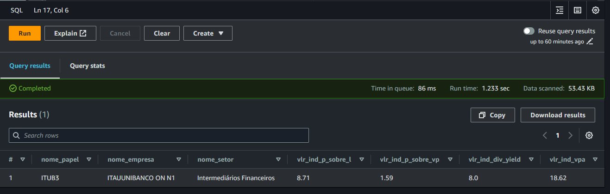
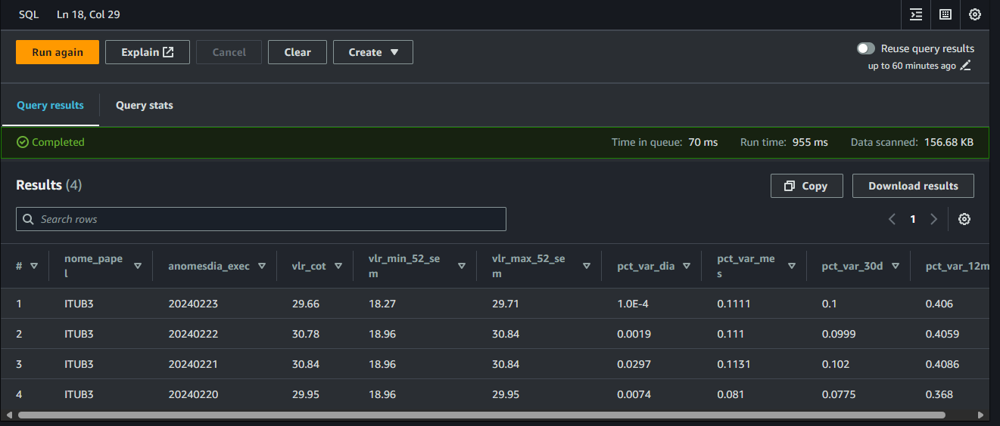
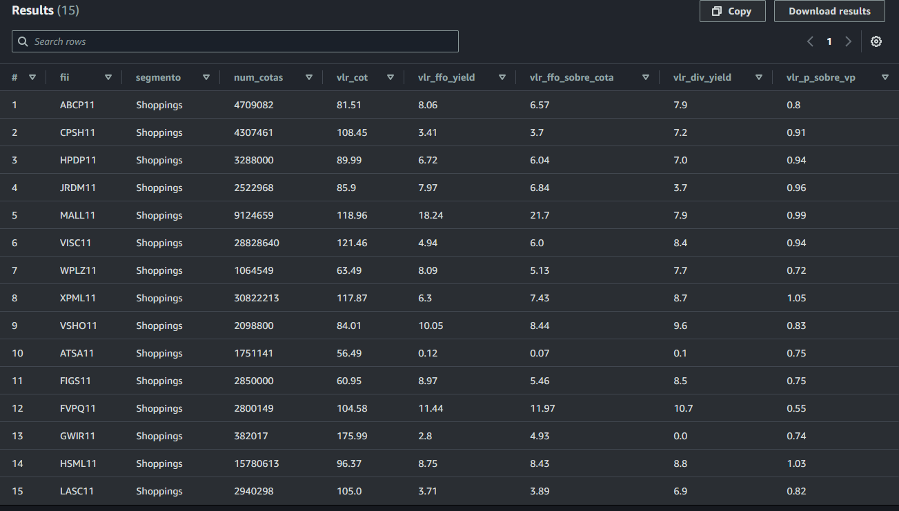
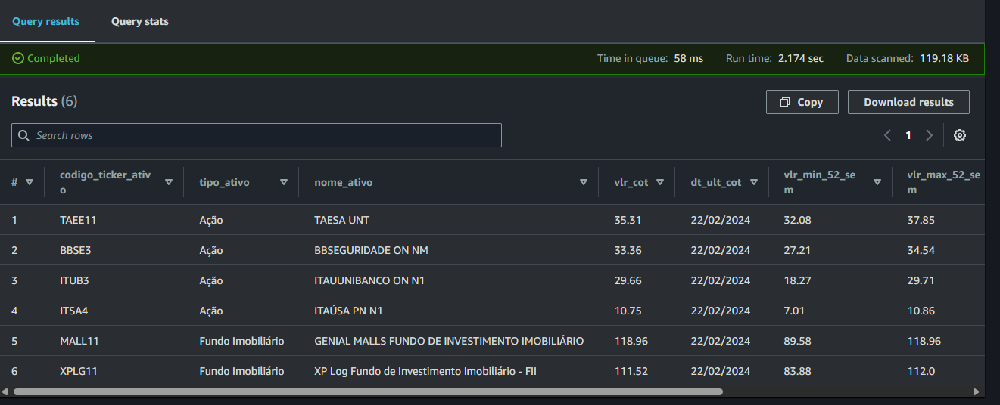

# Valor para o Usuário

Esta seção da documentação tem o nobre desejo de proporcionar uma visão prática, ao usuário (e possíveis usuários) do módulo `pynvest-tools`, sobre algumas análises interessantes que podem ser feitas após a utilização do módulo.

Essencialmente, o conteúdo deste bloco será composto por *queries* SQL capazes de serem executadas no [Amazon Athena](https://aws.amazon.com/pt/athena/) de modo a obter resultados analíticos com os dados de indicadores financeiros coletados e armazenados pelos componentes implantados pelo módulo.

<small>
  :octicons-eye-16:
  **Observação:** as consultas SQL a serem exemplificadas abaixo consideram que as tabelas do módulo foram criadas juntamente com os databases recomendados quando o módulo é chamado com `flag_create_databases=true`.
</small>


## Verificando Indicadores de uma Ação

A tabela `tbsot_fundamentus_indicadores_acoes_prep` entregue na camada SoT do usuário contém informações preparadas de indicadores fundamentalistas de Ações listadas na B3. A *query* SQL abaixo permite retornar alguns desses indicadores para uma Ação específica, como a [ITUB3](https://www.google.com/search?q=itub3&oq=itub3&gs_lcrp=EgZjaHJvbWUyBggAEEUYOdIBBzUwN2owajGoAgCwAgA&sourceid=chrome&ie=UTF-8), por exemplo.

```sql
--Retornando indicadores da ação ITUB3
SELECT
    nome_papel,
    nome_empresa,
    nome_setor,
    vlr_ind_p_sobre_l,
    vlr_ind_p_sobre_vp,
    vlr_ind_div_yield,
    vlr_ind_vpa

FROM db_pynvest_sot.tbsot_fundamentus_indicadores_acoes_prep

WHERE nome_papel = 'ITUB3'
    --Filtrando apenas dados da última partição disponível
    AND anomesdia_exec = (
        SELECT MAX(anomesdia_exec) FROM db_pynvest_sot.tbsot_fundamentus_indicadores_acoes_prep
    )
```

??? example "Clique para visualizar o resultado da consulta SQL"
    <small>
        :octicons-light-bulb-16:
        **Dica:** clique na imagem para expandir.
    </small>

    

A consulta acima permite analisar um ativo financeiro (ação) em termos de alguns de seus principais indicadores, como [P/L](https://statusinvest.com.br/termos/p/p-l), [P/VP](https://statusinvest.com.br/termos/p/p-vp), [Dividend Yield](https://statusinvest.com.br/termos/d/dividend-yield) e [VPA](https://statusinvest.com.br/termos/p/p-vpa).

## Analisando Valor e Variação da Cotação

E se fosse preciso analisar o quanto o preço de uma ação evoluiu ao longo do tempo? E quanto a suas variações percentuais em diferentes épocas? Na consulta abaixo, continuamos olhando para o ativo ITUB3, agora sob uma ótica vinculada ao quanto a cotação desse ativo sofreu modificações ao longo dos últimos dias.

```sql
SELECT
    nome_papel,
    anomesdia_exec,
    vlr_cot,
    vlr_min_52_sem,
    vlr_max_52_sem,
    pct_var_dia,
    pct_var_mes,
    pct_var_30d,
    pct_var_12m

FROM db_pynvest_sot.tbsot_fundamentus_indicadores_acoes_prep

WHERE nome_papel = 'ITUB3'
    --Filtrando os últimos 4 dias de dados
    AND anomesdia_exec >= CAST(date_format(date_add('day', -4, now()), '%Y%m%d') AS INTEGER)

ORDER BY anomesdia_exec DESC
```

??? example "Clique para visualizar o resultado da consulta SQL"
    <small>
        :octicons-light-bulb-16:
        **Dica:** clique na imagem para expandir.
    </small>

    

No resultado analítico acima, é possível acompanhar a evolução da cotação de um determinado ativo, bem como suas variações percentuais em diferentes épocas (dia, mês, 30 dias, 12 meses, entre outros).


## Indicadores de Fundos Imobiliários

E se a ideia fosse observar mais a fundo alguns Fundos Imobiliários específicos? Na consulta abaixo, alguns indicadores fundamentalistas de FIIs de um determinado setor são retornados para fins de comparação.

Vamos supor, que nessa análise, deseja-se comparar apenas FIIs do segmento "shopping" e com valor de cotação entre R$50,00 e R$100,00.

```sql
SELECT
    fii,
    segmento,
    num_cotas,
    vlr_cot,
    vlr_ffo_yield,
    vlr_ffo_sobre_cota,
    vlr_div_yield,
    vlr_p_sobre_vp

FROM db_pynvest_sot.tbsot_fundamentus_indicadores_fiis_prep

WHERE segmento = 'Shoppings'
    AND anomesdia_exec = (SELECT max(anomesdia_exec) FROM db_pynvest_sot.tbsot_fundamentus_indicadores_fiis_prep)
    AND pct_var_dia IS NOT NULL
    AND vlr_cot BETWEEN 50 AND 150
```

??? example "Clique para visualizar o resultado da consulta SQL"
    <small>
        :octicons-light-bulb-16:
        **Dica:** clique na imagem para expandir.
    </small>

    

## Análise de Cotação de Ações e FIIs

Em um outro cenário igualmente interessante, supõe-se que o usuário tenha uma carteira de ativos que ele já investe (ou pretende investir) e, para balizar sua próxima decisão financeira, o mesmo deseja analisar o valor de cotação de alguns desses ativos da carteira (misturando Ações e FIIs).

Para este caso, o ideal é utilizar a tabela especializada de cotações de ativos (disponibilizada na camada Spec).

```sql
SELECT
    codigo_ticker_ativo,
    tipo_ativo,
    nome_ativo,
    vlr_cot,
    dt_ult_cot,
    vlr_min_52_sem,
    vlr_max_52_sem,
    pct_var_dia,
    pct_var_mes,
    pct_var_30d

FROM db_pynvest_spec.tbspec_fundamentus_cotacao_ativos

WHERE codigo_ticker_ativo IN ('ITUB3', 'ITSA4', 'BBSE3', 'TAEE11', 'XPLG11', 'MALL11')
    AND anomesdia_exec = (SELECT max(anomesdia_exec) FROM db_pynvest_sot.tbsot_fundamentus_indicadores_fiis_prep)

ORDER BY tipo_ativo, vlr_cot DESC
```

??? example "Clique para visualizar o resultado da consulta SQL"
    <small>
        :octicons-light-bulb-16:
        **Dica:** clique na imagem para expandir.
    </small>

    